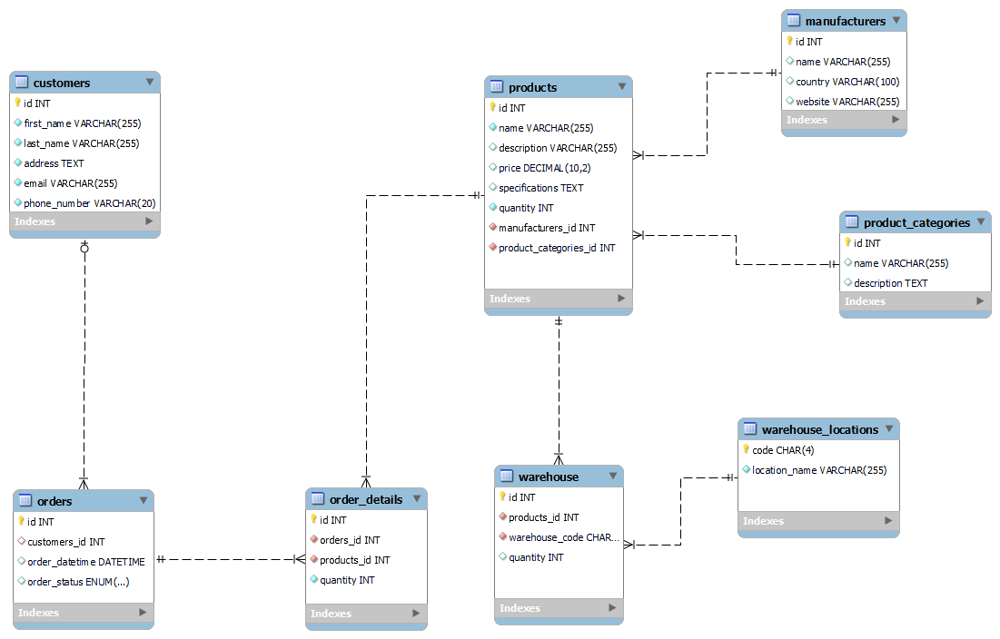

## Скриншоты



## Типовые запросы

1. Добавление нового продукта в каталог:
```Mysql
INSERT INTO products 
(name, description, price,
 specifications, quantity,
 manufacturers_id, product_categories_id) 
VALUES ('NVIDIA GeForce RTX 3060', 'Видеокарта NVIDIA GeForce RTX 3060',
 399.99, '12GB GDDR6, 192-bit, 1320 MHz', 30, 6, 4);
```
2. Поиск продукта по ключевому слову:
```Mysql
SELECT * FROM products WHERE name LIKE '%Intel Core i9-12900K%';
```

3. Создание заказа покупателем:
```Mysql
INSERT INTO orders (customers_id, order_datetime, order_status)
VALUES (1, NOW(), 'processed');

INSERT INTO order_details (orders_id, products_id, quantity, from_reserves)
VALUES (7, 1, 12, 'no');
```

4. Получение списка заказов для конкретного покупателя:
```Mysql
SELECT * FROM customers WHERE id = 1;
```

5. Получение общего количества продуктов на складе:
```Mysql
SELECT SUM(quantity) AS total_quantity FROM reserves;
```
## Отдельные роли
1. роль администратора
```Mysql
CREATE USER 'admin'@'localhost' IDENTIFIED BY 'PaSsWoRd';

GRANT ALL PRIVILEGES ON *.* TO 'admin'@'localhost' WITH GRANT OPTION;

FLUSH PRIVILEGES;
```
2. роль менеджера
```Mysql
CREATE USER 'manager'@'localhost' IDENTIFIED BY 'PaSsWoRd';

GRANT SELECT, INSERT, UPDATE, DELETE ON shop.products TO 'manager'@'localhost';
GRANT SELECT, INSERT, UPDATE, DELETE ON shop.customers TO 'manager'@'localhost';
GRANT SELECT, INSERT, UPDATE, DELETE ON shop.orders TO 'manager'@'localhost';
GRANT SELECT, INSERT, UPDATE, DELETE ON shop.order_details TO 'manager'@'localhost';
GRANT SELECT ON shop.manufacturers TO 'manager'@'localhost';
GRANT SELECT ON shop.product_categories TO 'manager'@'localhost';
GRANT SELECT ON shop.reserves TO 'manager'@'localhost';
GRANT SELECT ON shop.warehouses TO 'manager'@'localhost';

FLUSH PRIVILEGES;
```
3. роль клиента
```Mysql
CREATE USER 'customer'@'localhost';

GRANT SELECT ON shop.products TO 'customer'@'localhost';
GRANT SELECT ON shop.product_categories TO 'customer'@'localhost';
GRANT SELECT ON shop.manufacturers TO 'customer'@'localhost';
GRANT INSERT ON shop.orders TO 'customer'@'localhost';

FLUSH PRIVILEGES;
```


