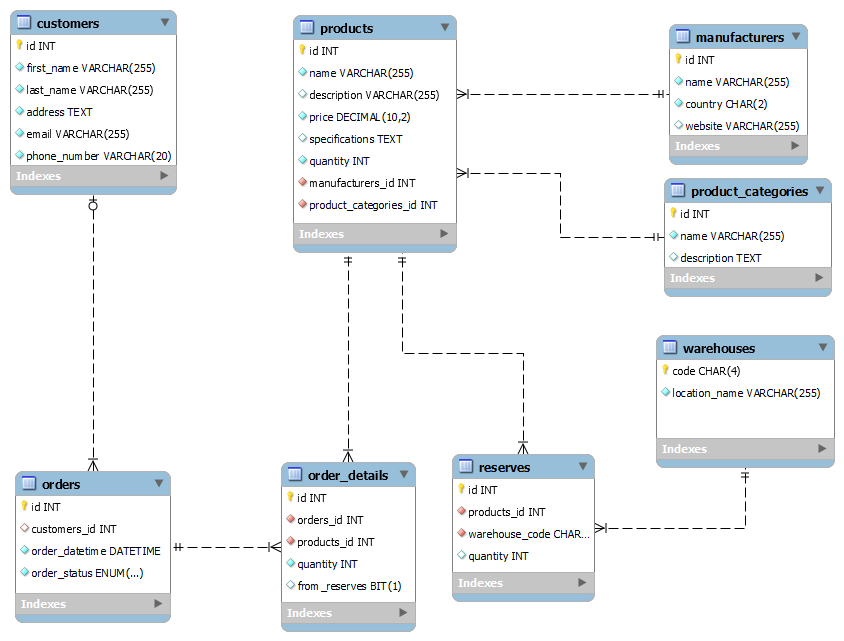

## Скриншоты



## Типовые запросы

1. Добавление нового продукта в каталог:
```Mysql
INSERT INTO products 
(name, description, price,
 specifications, quantity,
 manufacturers_id, product_categories_id) 
VALUES ('NVIDIA GeForce RTX 3060', 'Видеокарта NVIDIA GeForce RTX 3060',
 399.99, '12GB GDDR6, 192-bit, 1320 MHz', 30, 6, 4);
```
2. Поиск продукта по ключевому слову:
```Mysql
SELECT * FROM products WHERE name LIKE '%Intel Core i9-12900K%';
```

3. Создание заказа покупателем:
```Mysql
INSERT INTO orders (customers_id, order_datetime, order_status)
VALUES (1, NOW(), 'processed');

INSERT INTO order_details (orders_id, products_id, quantity, from_reserves)
VALUES (7, 1, 12, 'no');
```

4. Получение данных конкретного покупателя:
```Mysql
SELECT * FROM customers WHERE id = 1;
```

5. Получение общего количества продуктов на складе:
```Mysql
SELECT SUM(quantity) AS total_quantity FROM reserves;
```
## Отдельные роли
1. роль администратора
```Mysql
-- создание роли admin_role
CREATE ROLE IF NOT EXISTS admin_role; 

-- Предоставление полных прав администратору на схему housing
GRANT ALL PRIVILEGES ON shop.* TO admin_role;

-- создание пользователя и назначение ему роли admin_role
CREATE USER IF NOT EXISTS 'admin'@'localhost' IDENTIFIED BY 'PaSsWoRd';
GRANT admin_role TO 'admin'@'localhost';

-- установка роли admin_role по умолчанию для пользователя admin
SET DEFAULT ROLE admin_role TO 'admin'@'localhost';

FLUSH PRIVILEGES;
```
2. роль менеджера
```Mysql
-- создание роли manager_role
CREATE ROLE IF NOT EXISTS 'manager_role';

-- назначение привилегий роли manager_role
GRANT SELECT, INSERT, UPDATE, DELETE ON shop.products TO 'manager_role';
GRANT SELECT, INSERT, UPDATE, DELETE ON shop.customers TO 'manager_role';
GRANT SELECT, INSERT, UPDATE, DELETE ON shop.orders TO 'manager_role';
GRANT SELECT, INSERT, UPDATE, DELETE ON shop.order_details TO 'manager_role';
GRANT SELECT ON shop.manufacturers TO 'manager_role';
GRANT SELECT ON shop.product_categories TO 'manager_role';
GRANT SELECT ON shop.reserves TO 'manager_role';
GRANT SELECT ON shop.warehouses TO 'manager_role';

-- назначение привилегий на выполнение хранимых процедур
GRANT EXECUTE ON PROCEDURE shop.get_products_by_manufacturer TO 'manager_role';
GRANT EXECUTE ON PROCEDURE shop.get_products_by_category TO 'manager_role';
GRANT EXECUTE ON PROCEDURE shop.update_product_price TO 'manager_role';
GRANT EXECUTE ON PROCEDURE shop.calculate_order_total TO 'manager_role';
GRANT EXECUTE ON PROCEDURE shop.make_order TO 'manager_role';

-- создание пользователя manager и назначение ему роли manager_role
CREATE USER IF NOT EXISTS 'manager'@'localhost' IDENTIFIED BY 'PaSsWoRd';
GRANT 'manager_role' TO 'manager'@'localhost';

-- установка роли manager_role по умолчанию для пользователя manager
SET DEFAULT ROLE 'manager_role' FOR 'manager'@'localhost';

-- применение изменений
FLUSH PRIVILEGES;

```
3. роль клиента
```Mysql
-- создание роли customer_role
CREATE ROLE IF NOT EXISTS 'customer_role';

-- назначение привилегий роли customer_role
GRANT SELECT ON shop.products TO 'customer_role';
GRANT SELECT ON shop.product_categories TO 'customer_role';
GRANT SELECT ON shop.manufacturers TO 'customer_role';
GRANT INSERT ON shop.orders TO 'customer_role';

-- создание пользователя customer и назначение ему роли customer_role
CREATE USER IF NOT EXISTS 'customer'@'localhost' IDENTIFIED BY 'SecurePassword';

-- назначение роли customer_role пользователю customer
GRANT 'customer_role' TO 'customer'@'localhost';

-- установка роли customer_role по умолчанию для пользователя customer
SET DEFAULT ROLE 'customer_role' FOR 'customer'@'localhost';

-- применение изменений
FLUSH PRIVILEGES;
```


