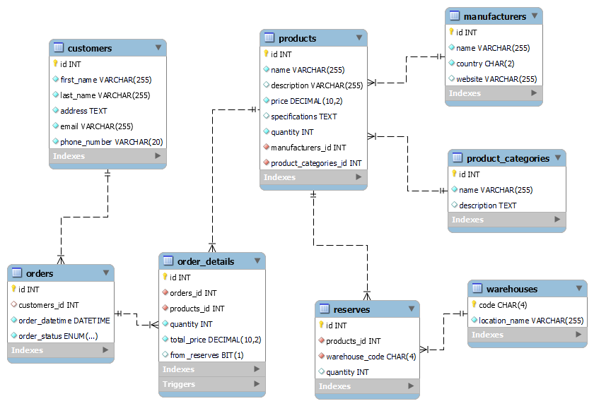

## Скриншоты



## Типовые запросы

1.Добавление нового продукта в каталог:
```Mysql
INSERT INTO products (name, description, price, specifications, quantity, manufacturers_id, product_categories_id) 
VALUES ('Название продукта', 'Описание продукта', 99.99, 'Спецификации продукта', 100, 1, 1);
```

```Mysql
Поиск продукта по ключевому слову:
SELECT * FROM products WHERE name LIKE '%ключевое_слово%';
```

```Mysql
Создание заказа покупателем:
INSERT INTO orders (customers_id, order_datetime, order_status)
VALUES (1, NOW(), 'создан');
```

```Mysql
Получение списка заказов для конкретного покупателя:
SELECT * FROM orders WHERE customers_id = 1;
```

```Mysql
Получение общего количества продуктов на складе:
SELECT SUM(quantity) AS total_quantity FROM warehouse;
```


